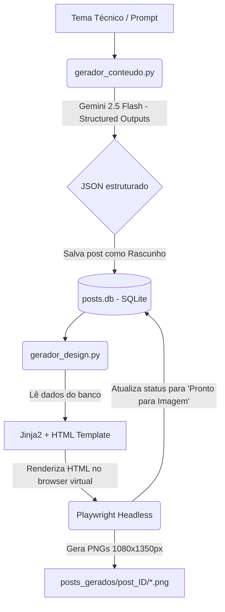

# 🤖 Agente de Geração de Conteúdo e Design para Instagram (@djangiota)

Este é um projeto automatizado desenvolvido em **Python** para criar posts do tipo carrossel para o perfil do Instagram **@djangiota**. O agente utiliza a inteligência artificial do **Gemini 2.5 Flash** para gerar conteúdos técnicos e educativos focados no ecossistema Python (Django, FastAPI, Backend e Engenharia de Dados) e renderiza slides visuais de alta definição (1080x1350px) em um estilo dark moderno de terminal utilizando **Playwright** e **Jinja2**.

---

## 🗺️ Fluxo de Funcionamento

O sistema opera de forma modular dividida em etapas integradas locais:



---

## 🛠️ Tecnologias Utilizadas

- **Gerenciador de Dependências**: [uv](https://github.com/astral-sh/uv) (gerenciamento rápido de pacotes e ambientes virtuais).
- **Motor de Inteligência Artificial**: `google-genai` SDK (`gemini-2.5-flash`) com **Structured Outputs** (Pydantic schemas) para consistência no formato retornado.
- **Banco de Dados**: SQLite para persistência simples do histórico de posts e seus respectivos status (`Rascunho`, `Pronto para Imagem`, `Postado`).
- **Motor de Design**: [Playwright](https://playwright.dev/python/) para captura e exportação de elementos HTML como imagens e Jinja2 para a compilação do template dinâmico [card_template.html](file:///c:/Users/Ariadne/dev/instagram-posts-generator-agent/templates/card_template.html).

---

## 📂 Estrutura do Projeto

*   [gerador_conteudo.py](file:///c:/Users/Ariadne/dev/instagram-posts-generator-agent/gerador_conteudo.py): Script CLI principal para geração de conteúdos técnicos textuais por meio da API do Gemini, listagem de posts salvos e atualização de status.
*   [gerador_design.py](file:///c:/Users/Ariadne/dev/instagram-posts-generator-agent/gerador_design.py): Módulo responsável pelo motor de design, aplicando parse do texto (como detecção de blocos de código e negrito) e gerando as imagens PNG finais a partir do template HTML.
*   [db.py](file:///c:/Users/Ariadne/dev/instagram-posts-generator-agent/db.py): Gerenciamento da conexão com o banco SQLite local (`posts.db`), inicialização das tabelas e transações.
*   [config.py](file:///c:/Users/Ariadne/dev/instagram-posts-generator-agent/config.py): Configuração do ambiente e validação das variáveis do `.env`.
*   [templates/card_template.html](file:///c:/Users/Ariadne/dev/instagram-posts-generator-agent/templates/card_template.html): Template Jinja2 estruturado em HTML/CSS para os slides do carrossel (estilo Dark Theme/Terminal com fontes customizadas *Plus Jakarta Sans* e *Fira Code*).
*   [escopo_agente_instagram.md](file:///c:/Users/Ariadne/dev/instagram-posts-generator-agent/escopo_agente_instagram.md): Escopo e planejamento das fases de desenvolvimento do agente.

---

## 🚀 Instalação e Configuração

### 1. Pré-requisitos
Certifique-se de possuir o gerenciador `uv` instalado em sua máquina. Caso não tenha, siga as instruções oficiais ou utilize:
```bash
# Windows (PowerShell)
irm https://astral.sh/uv/install.ps1 | iex
```

### 2. Configurar o Ambiente Virtual e Dependências
Execute os comandos abaixo na raiz do projeto para criar o ambiente virtual e instalar todas as dependências declaradas no [pyproject.toml](file:///c:/Users/Ariadne/dev/instagram-posts-generator-agent/pyproject.toml):
```bash
uv sync
```

### 3. Instalar o Browser do Playwright
Para habilitar a captura e geração das imagens via Playwright, instale o Chromium headless:
```bash
uv run playwright install chromium
```

### 4. Configurar as Variáveis de Ambiente
Copie o arquivo `.env.example` para `.env` e preencha as variáveis de ambiente necessárias:
```bash
cp .env.example .env
```
No arquivo `.env`, adicione a sua chave de API do Gemini:
```env
GEMINI_API_KEY=sua_chave_de_api_do_google_ai_studio
```

---

## 🕹️ Guia de Uso

### 1. Geração de Conteúdo Técnico
Para gerar um post do zero e salvá-lo no banco de dados local com o status `Rascunho`, execute o script [gerador_conteudo.py](file:///c:/Users/Ariadne/dev/instagram-posts-generator-agent/gerador_conteudo.py) passando o tema técnico desejado como argumento:
```bash
uv run gerador_conteudo.py "Boas Práticas de prefetch_related no Django ORM"
```

### 2. Listagem de Posts Gerados
Para visualizar a tabela com o histórico de posts salvos localmente:
```bash
uv run gerador_conteudo.py -l
# ou
uv run gerador_conteudo.py --list
```

### 3. Alteração Manual de Status
Caso precise ajustar manualmente o status de um post (por exemplo, após postar no Instagram):
```bash
uv run gerador_conteudo.py -u <ID_DO_POST> "Postado"
```
*(Status válidos: `Rascunho`, `Pronto para Imagem` e `Postado`)*

### 4. Geração Visual das Imagens
Para renderizar e exportar o HTML como imagens de alta definição PNG (no formato 1080x1350px recomendado pelo Instagram) do post mais recente criado:
```bash
uv run gerador_design.py
```
Caso queira gerar as imagens para um ID de post específico do banco de dados:
```bash
uv run gerador_design.py <ID_DO_POST>
```
As imagens serão salvas em uma pasta correspondente em `posts_gerados/post_<ID>/*.png`. Além disso, o script atualiza automaticamente o status do post para `Pronto para Imagem` no banco de dados local.

---

## 🗃️ Estrutura do Banco de Dados (SQLite)

O banco de dados local `posts.db` possui a seguinte estrutura de tabela (`posts`):

| Coluna | Tipo | Descrição |
| :--- | :--- | :--- |
| `id` | INTEGER (PK) | Identificador autoincrementado do post. |
| `tema` | TEXT | Tema/Prompt inicial enviado pelo usuário. |
| `title` | TEXT | Título curto gerado pela IA. |
| `carousel_cards` | TEXT | Lista em formato JSON das strings contendo o texto de cada card. |
| `caption` | TEXT | Legenda gerada com quebras de linha e hashtags. |
| `status` | TEXT | Status atual do post (`Rascunho`, `Pronto para Imagem`, `Postado`). |
| `created_at` | TIMESTAMP | Data e hora de criação do registro no banco. |
